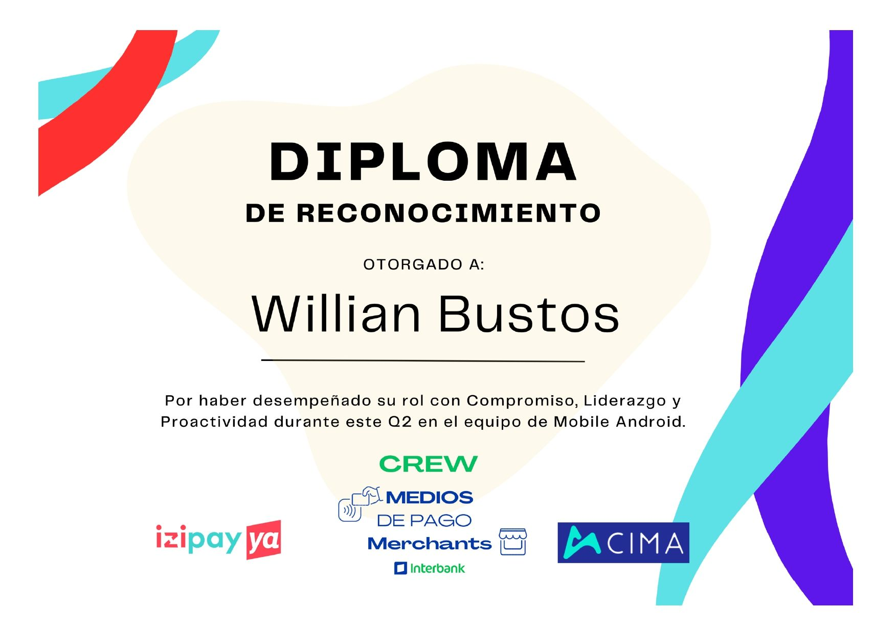
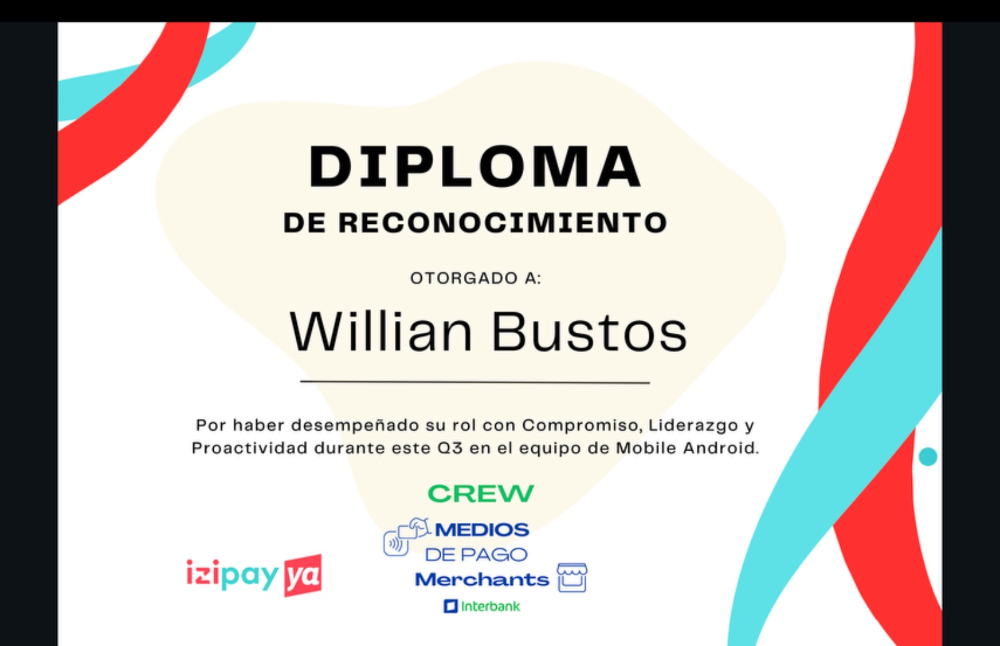

# Willian Andrés Bustos

### Ingeniero Informático | Desarrollador Android | Especialista en Aplicaciones Móviles

✉️ E-mail: [wilianandres1@gmail.com](mailto:wilianandres1@gmail.com)  
🌐 GitHub: [github.com/willianB](https://github.com/willianB)

## Quién soy

Ingeniero informático con más de 8 años de experiencia en desarrollo de software, enfocado en el desarrollo de aplicaciones móviles (Android e iOS). Apasionado por la resolución de problemas y la creación de soluciones innovadoras, con experiencia en desarrollo con **Android Jetpack**, **UnitTest**,**MVVM**, **Clean Architecture**, **Modularización** de aplicaciones y **Integracion y Despliegue Continuo**. Mi objetivo es seguir creciendo como desarrollador, aplicando las mejores prácticas, como **Código limpio** y patrones de diseño, en cada proyecto.

Mi motivación es aprender constantemente y aplicar mis conocimientos para trabajar en equipo y generar soluciones de alto impacto. Actualmente estoy en un rol de **Android Developer Sr** en **Globant**, y he trabajado en múltiples proyectos para empresas como **Pragma** y **Integra Grupo Tecnológico LTDA**.

## Experiencia Profesional

### Globant (2021 - Actualidad) - Popayán  
**Android Developer Senior**  
- Desarrollo y mantenimiento de aplicaciones móviles modulares.  
- Implementación de arquitectura MVVM, Clean Architecture y Android Feature Delivery.  

### Pragma (2020 - 2021) - Medellín  
**Desarrollador de Software**  
- Desarrollo de apps móviles para Android e iOS con enfoque en IoT y conexiones Bluetooth.  

### Integra Grupo Tecnológico LTDA (2016 - 2020) - Popayán  
**Programador de Software**  
- Participación en proyectos de desarrollo web y móvil, colaborando con equipos multidisciplinarios.

### HDS (2014 - 2015) - Popayán  
**Tecnólogo Desarrollador B**  
- Desarrollo y mantenimiento de software basado en tecnologías móviles y web.

## Estudios

- **Ingeniero Informático** (2019) - Institución Universitaria Colegio Mayor del Cauca
- **Especialización Tecnológica en Desarrollo de Aplicaciones Móviles** (2015) - SENA
- **Tecnólogo en Análisis y Desarrollo de Sistemas de Información** (2014) - SENA
- **Técnico en Sistemas** (2011)
- **Bachiller Técnico Industrial** (2010) - Institución Educativa Don Bosco

## Habilidades Técnicas

- **Lenguajes**: Java, Kotlin, Swift
- **Frameworks**: Android Jetpack, Compose, Coroutines
- **Metodologías**: MVVM, Clean Architecture, Modularización de apps, Git Flow, BDD
- **Desarrollo Móvil**: Android, iOS, IoT, Bluetooth
- **Otros**: GIT, Android Feature Delivery

## Logros y Premios

- **WorldSkills Colombia 2013**: Medalla de Bronce en Diseño Web a nivel nacional.  
- **Senasoft 2013**: Primer puesto a nivel nacional en programación PHP.

- **Reconocimiento Interbank Perú Q2 (2024)**

- **Reconocimiento Interbank Perú Q3 (2024)**

